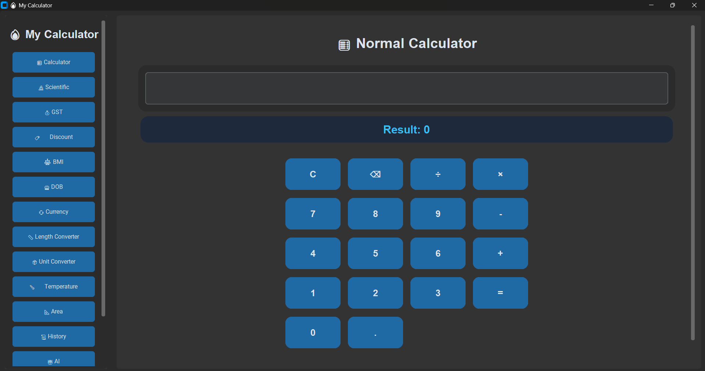
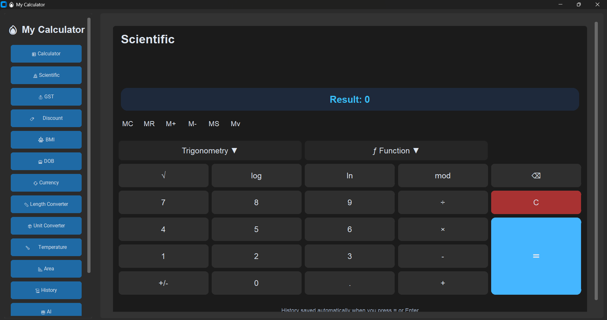
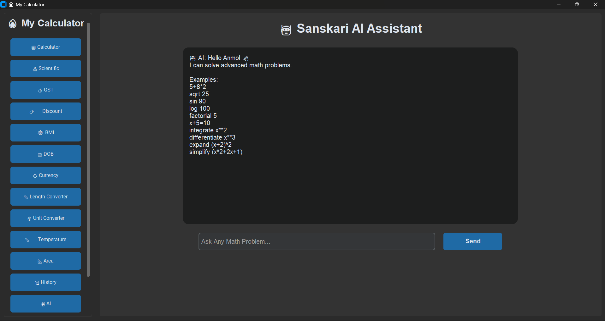
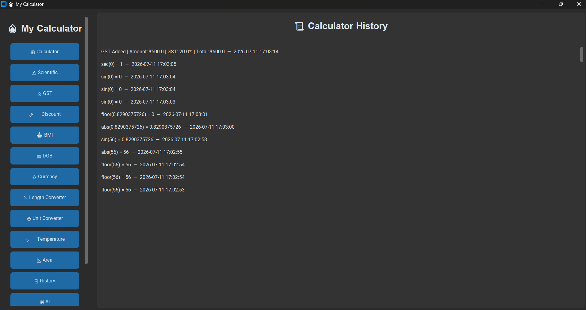

# 🚀 AI Calculator App

A modern Python-based AI Calculator App built using **CustomTkinter**. This project provides multiple calculators and converters in one clean and user-friendly desktop application.

## ✨ Features

- 🧮 Normal Calculator
- 🔬 Scientific Calculator
- 💰 GST Calculator
- 💸 Discount Calculator
- ⚖️ BMI Calculator
- 🎂 Age (DOB) Calculator
- 💱 Currency Converter
- 📏 Unit Converter
- 🌡️ Temperature Converter

- 📐 Area Calculator
- 📜 Calculation History
- 🤖 AI Assistant
- 🎨 Modern CustomTkinter UI
- 🌙 Dark Theme Support

---


## ⭐ Support

If you like this project, please ⭐ Star the repository.

- 📐 Area Calculator
- 📜 Calculation History
- 🤖 AI Assistant
- 🎨 Modern CustomTkinter UI
- 🌙 Dark Theme Support

---

## 🛠️ Built With

- Python 3
- CustomTkinter
- SQLite
- Requests
- Tkinter
- Math Module

---

## 📂 Project Structure

```

Calculator-App/
│
├── main.py
├── database.py
├── database.db
├── theme.py
├── voice.py
├── requirements.txt
│
├── pages/
│   ├── normal_calculator.py
│   ├── scientific_calculator.py
│   ├── gst_calculator.py
│   ├── discount_calculator.py
│   ├── bmi_calculator.py
│   ├── dob_calculator.py
│   ├── currency_converter.py
│   ├── unit_converter.py
│   ├── temperature_calculator.py
│   ├── area.py
│   ├── history_page.py
│   └── ai_section.py
```

---

## 📦 Installation

Clone the repository

```bash
git clone https://github.com/Anmolkumar108/Calculator-App-Py.git
```

Go to the project folder

```bash
cd Calculator-App-Py
```

Install dependencies

```bash
pip install -r requirements.txt
```

Run the application

```bash
python Calculator-App/main.py
```

---


## 📸 Screenshots

### Home Page



### Scientific Calculator



### AI Assistant



### History



---

## 🎯 Future Plans

- Voice Assistant
- More AI Features
- Theme Customization
- Better UI Animations
- Online Calculation History
- More Unit Converters

---

## 👨‍💻 Developer

**Anmol Kumar**

GitHub:
https://github.com/Anmolkumar108

---

## ⭐ Support

If you like this project, please ⭐ Star the repository.
